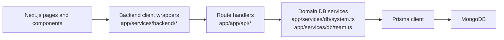
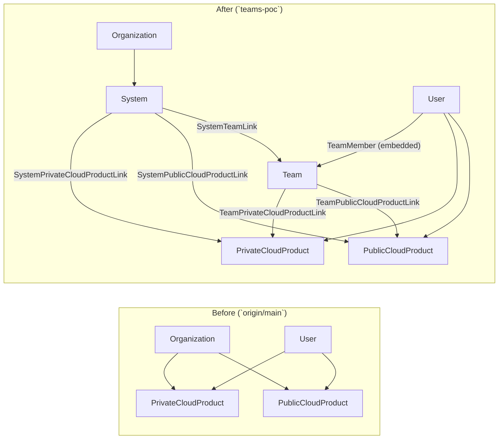
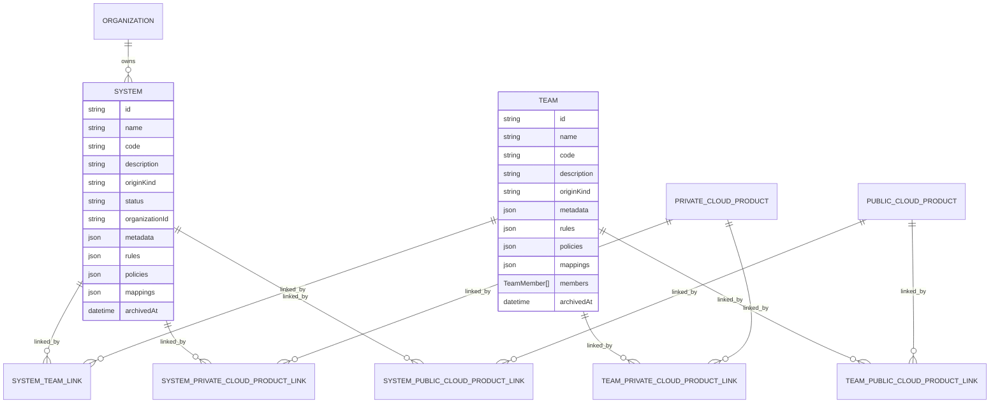
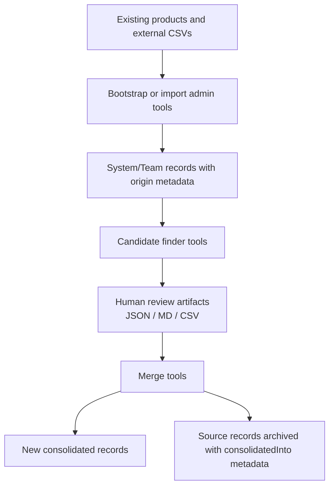

# Architect Handoff: `teams-poc` Branch

## Purpose

This document provides a technical summary of the functional and structural changes introduced by the `teams-poc` branch so an incoming architect can assess what the PoC proves, what it changes in the current application, and what would need to be hardened for production.

The summary is based on the branch delta against `origin/main` and focuses on the implemented architecture, not just the intended design.

## Executive Summary

This branch evolves the Platform Services Registry from a strictly product-centric application into a broader registry PoC with three major additions:

1. **First-class `System` and `Team` entities** with persistence, APIs, UI, permissions, and event logging.
2. **A linking model** that associates systems and teams with each other and with existing private-cloud and public-cloud products without changing existing product workflows.
3. **An operational data-shaping toolkit** that can bootstrap, import, analyze, deduplicate, and consolidate systems and teams from existing registry products and external division CSV data.

The implementation is intentionally **additive**. Existing product provisioning, billing, request flows, and product-centric authorization remain intact. The PoC demonstrates how a future product could layer a more durable portfolio/team model on top of the current registry without breaking legacy workflows.

## What This Branch Introduces Functionally

### 1. New top-level registry concepts

The branch adds persistent representations for:

-   **Systems**: logical containers for an application or service estate
-   **Teams**: groups of people with freeform roles who work on systems and resources

These are treated as new management surfaces rather than replacements for products.

### 2. New user-facing management surfaces

The application now exposes:

-   `/systems`
-   `/systems/create`
-   `/systems/[id]`
-   `/teams`
-   `/teams/create`
-   `/teams/[id]`

These pages support:

-   list and search
-   create and update
-   archive
-   bulk archive from list pages
-   origin/provenance display
-   consolidation metadata display
-   manual linking and unlinking
-   team member maintenance

### 3. Read-only attachment visibility on existing product pages

Existing product detail screens now show a **Systems and Teams** panel that surfaces which systems and teams are attached to that product.

This is important architecturally because it proves the new model can coexist with the product model while leaving product ownership and provisioning logic unchanged.

### 4. New top-level information architecture

The branch starts reframing the app as a broader registry:

-   `/home` and `/dashboard` now lead to a **Registry Dashboard**
-   `/resources` introduces resource-area entry points
-   `/requests` aggregates private-cloud and public-cloud request queues onto one page
-   `Systems` and `Teams` appear in the user menu
-   `legacy-home` preserves the old tabbed landing page

This is still a PoC information architecture, but it demonstrates a move away from the former exclusively product-first navigation.

### 5. Administrative tooling for data seeding and consolidation

The branch adds a large CLI/admin-tool surface under `app/app/admin-tools/` for:

-   bootstrapping systems from existing products
-   bootstrapping teams from existing products
-   importing systems and teams from division CSV sources
-   analyzing import sources before import
-   suggesting and applying organization mappings for imported systems
-   finding likely duplicate system clusters
-   finding likely duplicate team clusters
-   consolidating reviewed clusters into new canonical records
-   backfilling origin metadata
-   checking consolidation metadata

This is one of the most significant changes in the branch because it moves the PoC from "manual CRUD demo" to "data migration and curation workflow."

## High-Level Architecture



### Architectural reading of the implementation

The branch follows the existing application layering rather than introducing a separate service boundary:

-   **Pages/components** own the UX and orchestration.
-   **Backend service wrappers** encapsulate HTTP calls from the browser to Next route handlers.
-   **Route handlers** perform permission checks and request validation.
-   **DB services** hold the actual domain behavior around systems, teams, and attachments.
-   **Prisma + MongoDB** remain the persistence substrate.

That means the PoC proves the domain model _inside the current monolith_, not as a separate service decomposition.

## Data Model Changes

### Core new entities

The Prisma schema adds:

-   `System`
-   `Team`
-   `SystemTeamLink`
-   `SystemPrivateCloudProductLink`
-   `SystemPublicCloudProductLink`
-   `TeamPrivateCloudProductLink`
-   `TeamPublicCloudProductLink`
-   `SystemStatus`
-   `EntityOriginKind`
-   `TeamMember` composite type

### Entity model summary

| Entity       | Purpose                                        | Important fields                                                                                                                   |
| ------------ | ---------------------------------------------- | ---------------------------------------------------------------------------------------------------------------------------------- |
| `System`     | Logical application/service container          | `name`, `code`, `description`, `status`, `organizationId`, `originKind`, `metadata`, `rules`, `policies`, `mappings`, `archivedAt` |
| `Team`       | Group of people connected to systems/resources | `name`, `code`, `description`, `originKind`, `metadata`, `rules`, `policies`, `mappings`, `members`, `archivedAt`                  |
| `TeamMember` | Embedded team membership record                | `userId`, `roles[]`                                                                                                                |
| Link models  | Explicit many-to-many relationships            | foreign keys plus `createdAt`                                                                                                      |

### Before vs after conceptual model



This captures the key shift: products remain in place, but the branch introduces `System` and `Team` as additional top-level entities with explicit link models, creating a portfolio layer above product records.

### Persistence topology



### Important modeling choices

#### 1. Systems and teams are additive, not canonical replacements

Products remain the operational truth for:

-   provisioning
-   request flows
-   billing
-   product-specific permissions

The new entities are effectively a higher-level organizational and metadata layer.

#### 2. Link models are explicit

Relationships are persisted as dedicated link records rather than arrays of foreign keys embedded directly on the parent objects. This is a good production direction because it keeps relationship management explicit and extensible.

#### 3. Team membership is embedded and role names are freeform

`Team.members` is stored as a composite list inside the team document:

-   no join model to `User`
-   no normalized role vocabulary
-   no membership history
-   no membership-driven authorization

This is sufficient for the PoC but is one of the clearest areas that would need product-hardening.

#### 4. Provenance and consolidation use flexible JSON

The branch relies heavily on JSON fields:

-   `metadata`
-   `rules`
-   `policies`
-   `mappings`

This provides flexibility for the PoC and lets the admin tools persist traceability data without large schema churn, but it also means key business concepts are only partially normalized.

## Provenance, Import, and Consolidation Model

One of the strongest ideas in the branch is that new entities are not just manually created; they can also carry **origin metadata** describing how they were produced.

### Origin classification

`EntityOriginKind` supports:

-   `MANUAL`
-   `BOOTSTRAPPED_FROM_PUBLIC_CLOUD_PRODUCT`
-   `BOOTSTRAPPED_FROM_PRIVATE_CLOUD_PRODUCT`
-   `CONSOLIDATED_FROM_SYSTEM_CLUSTER`
-   `CONSOLIDATED_FROM_TEAM_CLUSTER`
-   `IMPORTED_OTHER`

The UI then derives:

-   an origin label
-   a human-readable origin summary
-   badge treatment for list/detail pages

### Metadata patterns used by the admin tools

The tools write metadata such as:

-   `metadata.provenance`
-   `metadata.consolidation`
-   `metadata.consolidatedInto`
-   `mappings.sourceSystems`
-   `mappings.sourceTeams`
-   import-source identifiers and file references

This creates traceability in both directions:

-   a consolidated record knows its source records
-   archived source records know what replaced them

### Import/consolidation workflow



### Why this matters

This branch is not just adding screens. It is testing a **registry curation model**:

-   discover records
-   seed records from existing sources
-   review and merge duplicates
-   preserve lineage

That is a meaningful architectural direction if the product is expected to become a system-of-record or at least a curated system-of-reference.

## API Surface Added

### Systems

-   `GET /api/systems`
-   `POST /api/systems`
-   `GET /api/systems/[id]`
-   `PUT /api/systems/[id]`
-   `DELETE /api/systems/[id]`
-   `POST /api/systems/archive`
-   `GET|POST|DELETE /api/systems/[id]/teams`
-   `GET|POST|DELETE /api/systems/[id]/private-cloud-products`
-   `GET|POST|DELETE /api/systems/[id]/public-cloud-products`

### Teams

-   `GET /api/teams`
-   `POST /api/teams`
-   `GET /api/teams/[id]`
-   `PUT /api/teams/[id]`
-   `DELETE /api/teams/[id]`
-   `POST /api/teams/archive`
-   `GET|PUT /api/teams/[id]/members`
-   `GET|POST|DELETE /api/teams/[id]/systems`
-   `GET|POST|DELETE /api/teams/[id]/private-cloud-products`
-   `GET|POST|DELETE /api/teams/[id]/public-cloud-products`

### Product attachment summaries

-   `GET /api/private-cloud/products/[licencePlate]/attachments`
-   `GET /api/public-cloud/products/[licencePlate]/attachments`

### API characteristics

The route handlers use existing application conventions:

-   `createApiHandler`
-   Zod validation
-   permission checks
-   DB-service delegation

This makes the PoC structurally consistent with the current codebase and lowers the cost of eventual productionization within the same architecture.

## Authorization and Audit Changes

### New permissions

The branch adds:

-   `viewSystems`
-   `manageSystems`
-   `viewTeams`
-   `manageTeams`

Current rules:

-   all authenticated users can view systems and teams
-   admins, private admins, and public admins can manage them

### Important non-change

Team membership does **not** grant resource or product access.

That separation is deliberate in the PoC:

-   `Team` is descriptive and organizational
-   product authorization remains product-role-driven

### Audit/event logging

The branch adds event types for:

-   `CREATE_SYSTEM`
-   `UPDATE_SYSTEM`
-   `DELETE_SYSTEM`
-   `CREATE_TEAM`
-   `UPDATE_TEAM`
-   `DELETE_TEAM`

The admin tools also emit create events when they create imported or consolidated records.

## User Experience and Organizational Structure Introduced

At a product/organization level, the branch introduces a new conceptual structure:

```mermaid
flowchart TD
    Registry["Platform Services Registry"]
    Registry --> Dashboard["Registry Dashboard"]
    Registry --> Systems["Systems"]
    Registry --> Teams["Teams"]
    Registry --> Resources["Resource Areas"]
    Registry --> Requests["Unified Requests View"]

    Systems --> SDetail["System detail"]
    SDetail --> STeams["Linked teams"]  %% codespell:ignore
    SDetail --> SPriv["Linked private-cloud products"]
    SDetail --> SPub["Linked public-cloud products"]

    Teams --> TDetail["Team detail"]
    TDetail --> TMembers["Members"]
    TDetail --> TSystems["Linked systems"]
    TDetail --> TPriv["Linked private-cloud products"]
    TDetail --> TPub["Linked public-cloud products"]
```

The app is still fundamentally backed by product records, but the branch demonstrates a new **portfolio view**:

-   teams own people and membership context
-   systems group related resources
-   products become linked resource instances within those higher-level containers

## What the PoC Proves

This branch successfully demonstrates that the existing application can absorb a broader registry model without destabilizing existing operational flows.

Specifically, it proves:

1. **The monolith can host new portfolio-level entities** without re-platforming.
2. **Systems and teams can be modeled independently of products** while still linking back to them.
3. **Existing product records can seed the new model** through deterministic admin tooling.
4. **Imported external records can be curated into the same model** with lineage preserved.
5. **The UI can support a top-level registry navigation model** alongside existing product views.

## Production-Relevant Gaps and Risks

These are the most important architectural gaps between the PoC and a production-ready implementation.

### 1. Canonical ownership is still unresolved

The PoC intentionally tolerates overlap and drift between:

-   product ownership/contact data
-   team membership
-   system metadata

A production plan would need clear rules for:

-   what becomes authoritative
-   what is derived
-   what can be edited where
-   how conflicts are resolved

### 2. Team membership is not yet a strong identity model

Current team membership is:

-   embedded JSON-like composite data
-   freeform roles
-   updated by replacement
-   not tied to authorization

A production design may need:

-   normalized role vocabulary
-   membership lifecycle/history
-   identity-source integration
-   eventual authorization mapping

### 3. Provenance is useful but weakly structured

The PoC's JSON-based provenance model is practical, but some concepts may deserve normalization if they become core workflow elements:

-   import runs
-   source datasets
-   candidate reviews
-   consolidation decisions
-   replacement lineage

### 4. Query/index strategy will need review

MongoDB + Prisma is fine for the PoC shape, but a production path should review:

-   indexes for `originKind`, `archivedAt`, `organizationId`, `code`
-   query patterns across links
-   search/filter scalability
-   reporting use cases across systems, teams, and products

### 5. Admin-tool workflow is operationally powerful but manual

The tooling is useful, but it assumes an operator workflow around files and review artifacts. A production plan should decide whether these remain:

-   internal scripts
-   back-office workflows
-   first-class in-product curation flows

### 6. Resource modeling is still transitional

The current branch still treats private-cloud and public-cloud products as the primary resource types. The design backlog already points toward future concepts like components, environments, repositories, APIs, and other non-cloud resources.

That means the current data model is a **bridge**, not the likely end-state.

## Recommended Architectural Interpretation

The best way to read this branch is:

-   **not** as a finished domain model
-   **not** as a production-ready information architecture
-   **but** as a credible proof that the registry can evolve from product registry to service/system/team registry

In practical terms, the PoC has established:

1. a viable set of new domain anchors (`System`, `Team`)
2. a workable attachment strategy
3. a traceable import/consolidation story
4. a safe additive path that does not break legacy operations

That is a strong base for a product-oriented architecture phase.

## Suggested Next-Step Design Topics for Production Planning

### Domain and source-of-truth

-   define canonical ownership boundaries between products, systems, and teams
-   decide whether systems or products become the primary planning object
-   define what a "resource" is beyond current cloud products

### Identity and access

-   decide whether team membership should eventually affect authorization
-   align team structure with enterprise identity/group models
-   define managed role vocabularies

### Data curation and governance

-   formalize import and consolidation workflows
-   decide which provenance concepts remain JSON and which become normalized tables/collections
-   define approval and audit expectations for merges

### Platform architecture

-   decide whether this remains inside the Next.js monolith or becomes service-separated
-   review MongoDB fitness for graph-like traversal and reporting needs
-   define index/search/reporting strategy

### UX and information architecture

-   decide whether the dashboard/resources/requests view becomes the primary shell
-   rationalize legacy product tabs versus new registry-oriented navigation
-   design for mixed audiences: operators, architects, and platform consumers

## Primary Files to Review

### Design docs

-   `design/PHASE1_SYSTEMS_TEAMS_SPEC.md`
-   `design/PHASE1_SYSTEMS_TEAMS_AS_BUILT.md`
-   `design/BACKLOG.md`

### Persistence and domain layer

-   `app/prisma/schema.prisma`
-   `app/services/db/system.ts`
-   `app/services/db/team.ts`
-   `app/services/db/origin.ts`
-   `app/types/system.ts`

### UI and navigation

-   `app/app/systems/page.tsx`
-   `app/app/systems/[id]/page.tsx`
-   `app/app/teams/page.tsx`
-   `app/app/teams/[id]/page.tsx`
-   `app/app/resources/page.tsx`
-   `app/app/requests/page.tsx`
-   `app/components/dashboard/RegistryDashboard.tsx`
-   `app/components/system/ProductAttachmentsPanel.tsx`

### API layer

-   `app/app/api/systems/**`
-   `app/app/api/teams/**`
-   `app/app/api/private-cloud/products/[licencePlate]/attachments/route.ts`
-   `app/app/api/public-cloud/products/[licencePlate]/attachments/route.ts`

### Admin-tool workflow

-   `app/app/admin-tools/README.md`
-   `app/app/admin-tools/import-division-sources.ts`
-   `app/app/admin-tools/find-system-merge-candidates.ts`
-   `app/app/admin-tools/find-team-merge-candidates.ts`
-   `app/app/admin-tools/merge-systems-from-candidates.ts`
-   `app/app/admin-tools/merge-teams-from-candidates.ts`
-   `app/app/admin-tools/backfill-origin-kind.ts`

## Closing Assessment

This branch is a meaningful PoC, not a thin UI experiment. It introduces a real secondary domain model, relationship persistence, provenance-aware migration tooling, and a new top-level navigation concept while preserving the existing operational product model.

For an architect taking this toward production, the key question is no longer "can the codebase support systems and teams?" The branch demonstrates that it can. The real next question is **which concepts become canonical, governed, and operationally enforced in the production design**.
