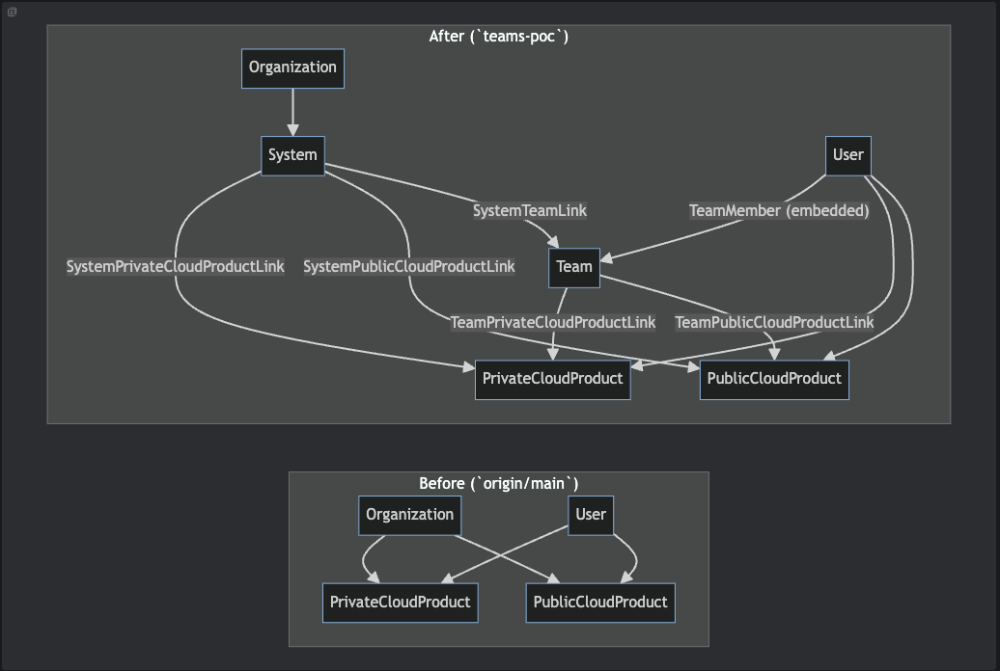
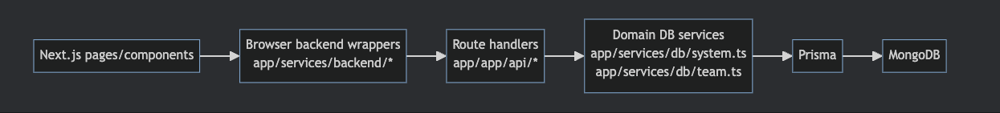
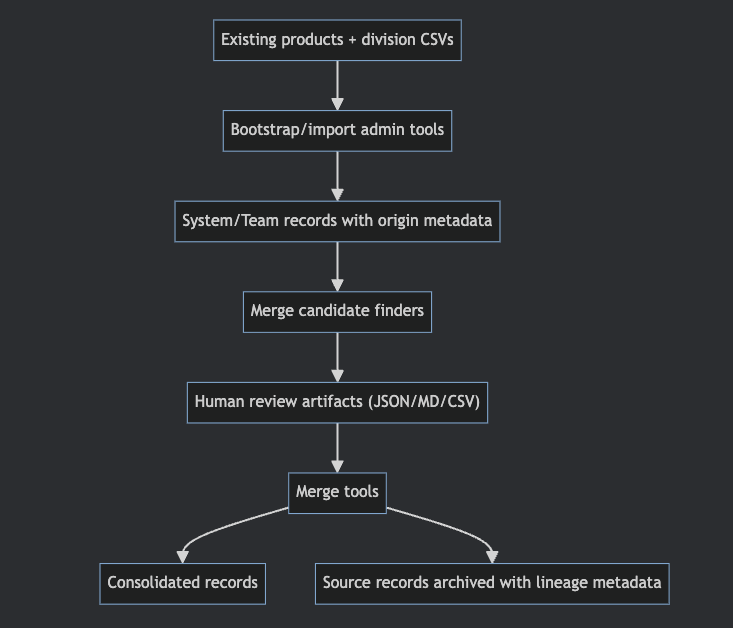

# `teams-poc` Architect Walkthrough

### Platform Services Registry PoC → Production Planning

Presenter: _TBD_
Audience: Incoming Architect
Reference: `design/TEAMS_POC_ARCHITECT_HANDOFF.md`

---

## 1. What this walkthrough covers

1. What changed in this branch
2. How the data model evolved
3. How the runtime architecture was extended
4. What this PoC proves
5. What needs to be hardened for production

---

## 2. Branch delta at a glance

-   Introduces first-class **System** and **Team** entities
-   Adds explicit link models between systems, teams, and cloud products
-   Adds UI/API surfaces for listing, creating, updating, archiving, and linking
-   Adds provenance + consolidation concepts (`originKind`, metadata lineage)
-   Adds admin tools for bootstrap/import/deduplicate/consolidate workflows
-   Keeps existing product provisioning/request/billing behavior intact

---

## 3. Before vs After (conceptual model)

  

---

## 4. New persisted structures

Core new schema elements:

-   `System`
-   `Team`
-   `TeamMember` (embedded type)
-   `SystemTeamLink`
-   `SystemPrivateCloudProductLink`
-   `SystemPublicCloudProductLink`
-   `TeamPrivateCloudProductLink`
-   `TeamPublicCloudProductLink`
-   `EntityOriginKind`, `SystemStatus`

Design intent: additive portfolio layer, not replacement of product model.

---

## 5. Runtime architecture (still monolithic, layered)

  

Implication: productionization can remain evolutionary inside current architecture.

---

## 6. Functional capabilities added

-   New pages: `/systems`, `/teams`, detail + create views
-   Link/unlink between systems ↔ teams ↔ cloud products
-   Team member management (freeform roles)
-   Product detail attachment panels (read-only links to systems/teams)
-   New permission flags:
    -   `viewSystems`, `manageSystems`
    -   `viewTeams`, `manageTeams`
-   New events: create/update/delete for system/team lifecycle

---

## 7. Operational data workflow introduced

  

This is the biggest PoC leap beyond simple CRUD.

---

## 8. What the PoC proves

1. Existing app can host system/team domain anchors without breaking legacy flows.
2. Portfolio-level relationships can be represented explicitly via link models.
3. Existing product data can seed the new model with traceable provenance.
4. Imported external records can be consolidated with lineage preserved.
5. Information architecture can evolve toward a top-level registry view.

---

## 9. Key production gaps to decide

-   Canonical ownership: product vs system vs team metadata authority
-   Team model hardening: role vocabulary, lifecycle, history, identity alignment
-   Authorization model: whether team membership affects access
-   Provenance normalization: what remains JSON vs becomes first-class entities
-   Search/index/reporting strategy across links and origins
-   Admin-tool UX: script-based ops vs integrated curation workflows

---

## 10. Suggested transition plan (discussion starter)

**Phase A: Stabilize model semantics**

-   Set source-of-truth rules and metadata contracts

**Phase B: Harden identity + access**

-   Normalize team roles and identity integration strategy

**Phase C: Operationalize curation**

-   Productize import/consolidation workflow and governance

**Phase D: Scale posture**

-   Indexing, reporting, observability, performance, and migration controls

---

## 11. Walkthrough file map

-   `design/TEAMS_POC_ARCHITECT_HANDOFF.md` (full narrative)
-   `app/prisma/schema.prisma` (data structures)
-   `app/services/db/system.ts`, `app/services/db/team.ts` (domain behavior)
-   `app/app/api/systems/**`, `app/app/api/teams/**` (API layer)
-   `app/app/admin-tools/**` (import + consolidation pipeline)
-   `app/app/systems/**`, `app/app/teams/**` (UI surfaces)

---

## 12. Decision checkpoint for architecture phase

**Core question:**
Do we keep Systems/Teams as an additive overlay, or make them the primary organizing model for future product operations?

This branch demonstrates the additive path is viable and low-risk.
