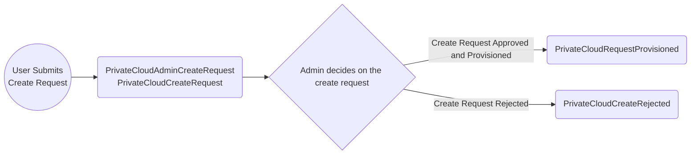
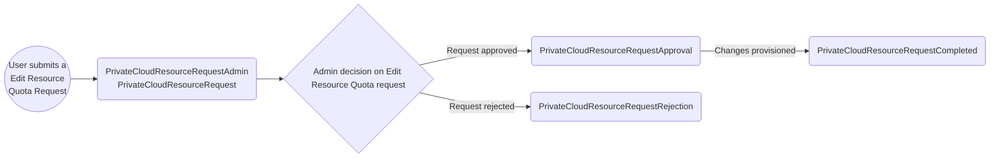
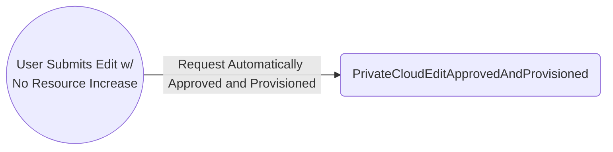
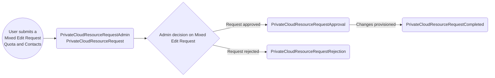
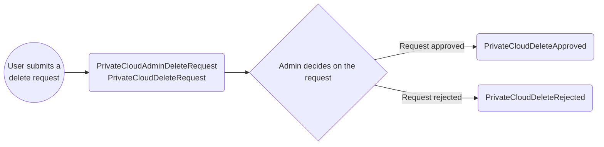

# Private Cloud Email Scenario

## Scenario 1. Product Create Request

**Description**: A new or existing user submits a request via the registry to have a namespace for their product.
This is assuming the user has already had an onboarding meeting, and meets the requirements for submitting a create request. Upon submitting the create request, the following emails may trigger.

1. **Notification sent to admins** containing:

    - Product Details (Name, Description, Ministry, Contacts of PO/TL(s), Cluster)
    - Actioned by text (who submitted the request)

2. **Notification sent to Product PO/TL(s)** containing:

    - Product Details (Name, Description, Ministry, Contacts of PO/TL(s), Cluster)

3. **Decision: Create request Approval/Rejection by Admin**

    - **3a. Approval sent to PO/TLs** containing:

        - Product Details (Name, Description, Ministry, Contacts of PO/TL(s))
        - Namespace Details (Cluster, Link to all four namespaces, Default values of namespaces)
        - Security Tools Info
        - Artifactory Info
        - Vault Info
        - ACS Info
        - Sysdig Info

    - **3b. Rejection sent to PO/TLs** containing:
        - Product Details (Name)
        - Admin review comments

## Scenario 2. Edit Request: Resource Quota Increase

**Description**: A PO/TLs of a product submits a request for more CPU, memory, and/or storage of 1 or more namespaces. Upon submitting the edit resource request, the following emails will trigger.

1. **Notification sent to admins** containing:

    - Description Changes (Product Name, Description, Ministry)
    - Contact Changes (Product Owner, Primary Technical Lead, Secondary Technical Lead)
    - Comments by user if provided
    - Resource Quotas with Current and Requested
    - Actioned by text (who submitted the request)

2. **Notification sent to PO/TL(s)** containing:

    - Description Changes (Product Name, Description, Ministry)
    - Contact Changes (Product Owner, Primary Technical Lead, Secondary Technical Lead)
    - Comments by user if provided
    - Resource Quotas with Current and Requested

3. **Decision: Resource Quota Edit Request Approval/Rejection by admins**

    - **3a. Approval sent to PO/TLs** containing:

        - Product Details (Name, Description, Ministry, Contacts of PO/TL(s))
        - Namespace Details with Previous and Approved values (Cluster, Link to all four namespaces)

    - **3b. Rejection Sub-Scenario** containing:
        - Product Details (Name, Description, Ministry, Contacts of PO/TL(s))
        - Admin review comments
        - Namespace Details with Previous and Rejected values (Cluster, Link to all four namespaces)

## Scenario 3. Edit Request: No Resource Quota Increase

**Description**: When a PO/TLs of a product edit their product where there is no increase in resources requested, the following emails will trigger.

1. **Summary of the changes provisioned sent to PO/TLs** containing:
    - Updated Description Changes (Product Name, Description, Ministry)
    - Updated Contact Changes
    - Updated Resource Quota Downgrades
    - Description Changes (Product Name, Description, Ministry)
    - Contact Changes (Product Owner, Primary Technical Lead, Secondary Technical Lead)
    - Comments by user if provided
    - Resource Quotas with Current and Requested

## Scenario 4. Mixed Edit Request: Quota Increase and Contact Change

**Description**: When a PO/TLs of a product edit their product with both Quota Increase and Contact Change.

1. **A notification sent to admins** containing:

    - Comments by user if provided
    - Name, Description, Ministry, Cluster, Contacts (all can be with Current and Requested sections if they are changed)
    - Quota Changes with Current and Requested sections

2. **Summary of changes submitted sent to PO/TLs** containing:

    - Product Details that were changed, Current and Requested (Name, Description, Ministry, Contacts of PO/TL(s), Quota)

3. **Decision: Mixed Quota Increase and Contact Change Request Approval/Rejection by admins**

    - **3a. Approval sent to PO/TLs** containing:

        - Product Details (Name, Description, Ministry, Contacts of PO/TL(s))
        - Namespace Details with Previous and Approved values (with link to the namespace that changes were made on)

    - **3b. Rejection Sub-Scenario** containing:
        - Product Details that were changed with Current and Rejected Quota
        - Admin review comments

## Scenario 5. Delete request is submitted

**Description**: When a PO/TLs of a product have removed all PVCs and resources deployed on their namespaces of a given product, then a user is eligible to submit a delete request. Upon a successful deletion check the user can submit the delete request and thus the following emails may trigger.

1. **A notification sent to admins** containing:

    - Product Details (Name, Description, Ministry, Contacts of PO/TL(s))
    - Actioned by text (who submitted the request)

2. **A summary sent to PO/TLs** containing:

    - Product Details (Name, Description, Ministry, Contacts of PO/TL(s))
    - Namespace Details (Cluster and Link to the 4 namespaces)

3. **Decision: Product Deletion Approval/Rejection by admins**

    - **3a. Approval confirmation sent to PO/TLs** containing:

        - Product Details (Name, Description, Ministry, Contacts of PO/TL(s))
        - Namespace Details (Cluster and Link to the 4 namespaces)

    - **3b. Rejection sent to PO/TLs** containing:
        - Review comments

