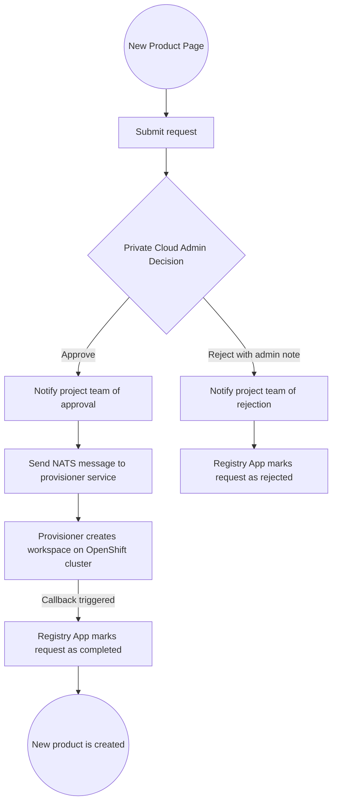
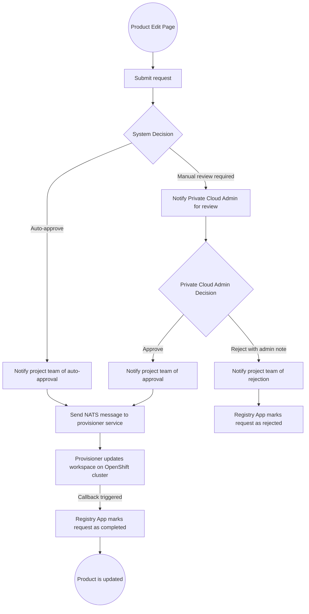
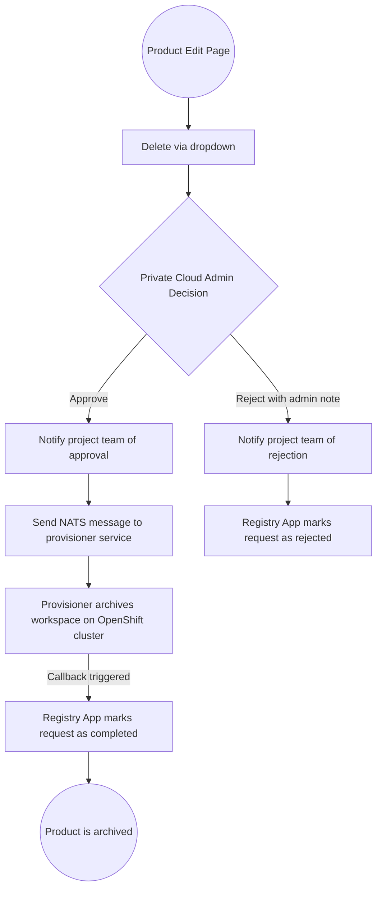

# Private Cloud Request Workflow

There are three types of private cloud requests, each with its own workflow leading to provisioning or completion.

---

## CREATE Request

This is the initial request submitted by a project team to launch a new product environment on OpenShift.

### Workflow

---

## EDIT Request

The project team submits an edit request to modify an existing product, such as updating quotas.

### Workflow

---

## DELETE Request

The project team submits a delete request to archive an existing product.

### Workflow

