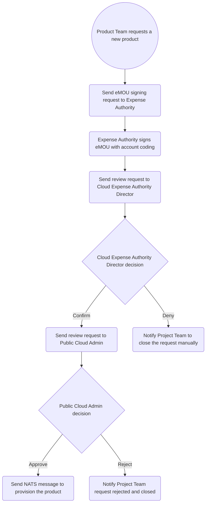
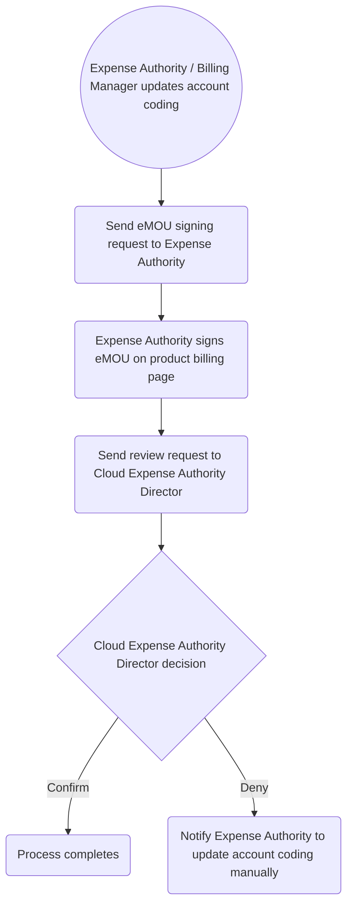
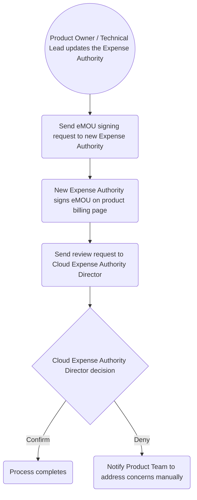

# Public Cloud eMOU Workflow Diagram

There are two scenarios where the eMOU workflow is triggered:

1. When a project team requests a new project set in the Public Cloud Workspaces.
2. When there is a change to the account coding or expense authority on an existing project set.

## 1. New project set request

## 2. Account Coding Updated

## 3. Expense Authority Changed

