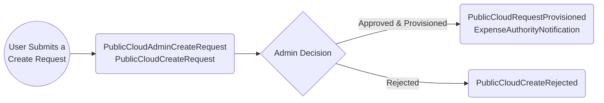
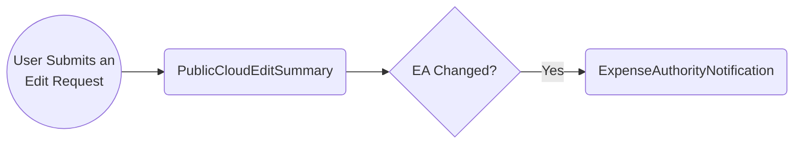
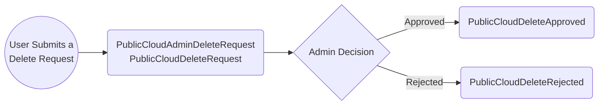

# Public Cloud Email Scenario

## Scenario 1: Product Create Request

**Description**:
A new or existing user submits a request via the Registry to create a product in the Public Cloud Landing Zone. This assumes the user has already completed an onboarding meeting and is eligible to submit a create request. Upon submission, the following emails may be triggered:

1. **Notification to Admins** containing:

    - Product Details: Name, Description, Ministry, and Contacts (PO/TL(s)/EA)
    - Landing Zone Details: Cloud Provider, Budget Info, Account Coding
    - First/Last name of the user who submitted the request

2. **Notification to Product PO/TL(s)** containing:

    - Product Details: Name, Description, Ministry, and Contacts (PO/TL(s)/EA)
    - Landing Zone Details: Cloud Provider, Budget Info, Account Coding

3. **Admin Decision: Approve or Reject the Create Request**

    - **If Approved**:

        - **Notification to PO/TL(s)** containing:
            - Product and Landing Zone Details (as above)
        - **Notification to Expense Authority** containing:
            - Product Details, including Licence Plate

    - **If Rejected**:
        - **Notification to PO/TL(s)** containing:
            - Product Details (as above)
            - Admin Review Comments

## Scenario 2: Edit Request

**Description**:
A PO/TL submits an edit request to change product details. Since no approval is needed, a summary email is sent instead.

1. **Summary to PO/TL(s)** containing:

    - User Comments
    - Description Changes: Name, Description, Ministry
    - Contact Changes
    - Budget Changes
    - Account Coding Changes

2. **If Expense Authority changed, summary to EA** containing:
    - Product Details: Name, Description, Ministry, Contacts (PO/TL(s)/EA), and Licence Plate

## Scenario 3: Delete Request

**Description**:
When a PO/TL is ready to decommission their product from the Public Cloud Landing Zone, they submit a delete request. The following emails may be triggered:

1. **Notification to Admins** containing:

    - Product Details: Name, Description, Ministry, and Contacts (PO/TL(s))
    - Landing Zone Details: Cloud Provider, Budget Info, Account Coding
    - First/Last name of the user who submitted the request

2. **Summary to PO/TL(s)** containing:

    - Product and Landing Zone Details (as above)

3. **Admin Decision: Approve or Reject the Delete Request**

    - **If Approved**:

        - **Confirmation to PO/TL(s)** containing:
            - Product and Landing Zone Details
            - Expense Authority Contact

    - **If Rejected**:
        - **Notification to PO/TL(s)** containing:
            - Product Details (as above)
            - Review Comments

