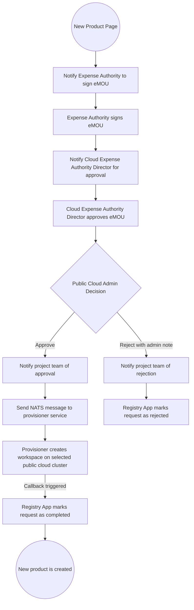
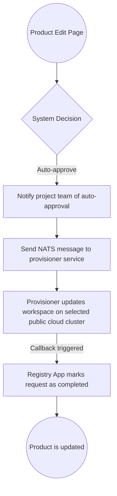
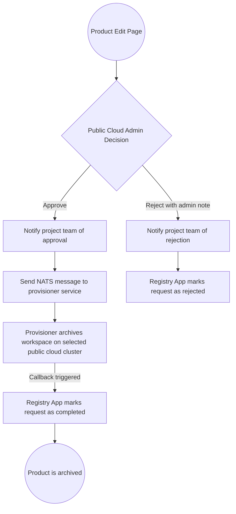

# Public Cloud Request Workflow

There are three types of public cloud requests, each with a distinct workflow that leads to provisioning or completion.

---

## CREATE Request

The project team initiates a request to launch a new product environment on a selected public cloud.

### Workflow

---

## EDIT Request

The project team submits an edit request to modify an existing product.

### Workflow

---

## DELETE Request

The project team submits a delete request to archive an existing product.

### Workflow

