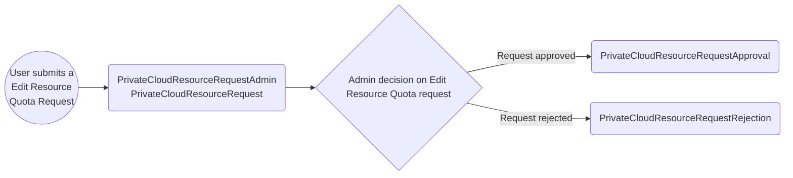
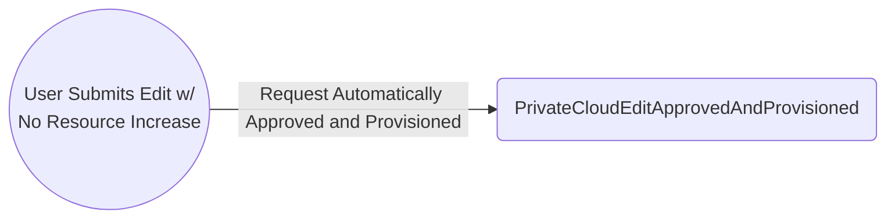
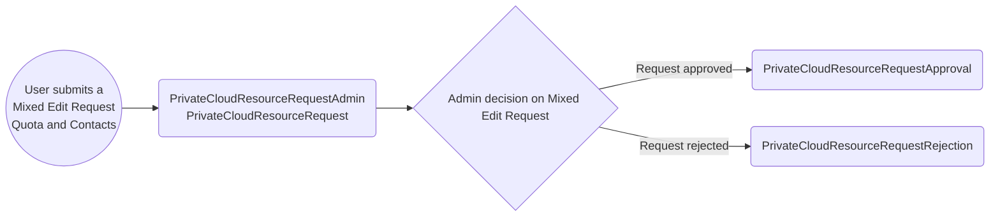

## Email Scenarios

### Private Cloud

#### Scenario 1. Product Create Request

**Description**: A new or existing user submits a request via the registry to have a namespace for their product.
This is assuming the user has already had an onboarding meeting, and meets the requirements for submitting a create request. Upon submitting the create request, the following emails may trigger.

1. **Notification sent to admins** containing:
   <ol type="a">
     <li>Product Details (Name, Description, Ministry, Contacts of PO/TL(s), Cluster)</li>
     <li>Actioned by text (who submitted the request)</li>
   </ol>
2. **Notification sent to Product PO/TL(s)** containing:
    <ol type="a">
      <li>Product Details (Name, Description, Ministry, Contacts of PO/TL(s), Cluster)</li>
   </ol>
3. **Decision: Create request Approval/Rejection by Admin**

- **3a. Approval sent to PO/TLs** containing:
   <ol type="a">
      <li>Product Details (Name, Description, Ministry, Contacts of PO/TL(s))</li>
      <li>Namespace Details (Cluster, Link to all four namespaces, Default values of namespaces)</li>
      <li>Security Tools Info</li>
      <li>Artifactory Info</li>
      <li>Vault Info</li>
      <li>ACS Info</li>
      <li>Sysdig Info</li>
   </ol>

- **3b. Rejection sent to PO/TLs** containing:
   <ol type="a">
      <li>Product Details (Name)</li>
      <li>Admin review comments</li>
   </ol>

#### Scenario 2. Edit Request: Resource Quota Increase

**Description**: A PO/TLs of a product submits a request for more CPU, memory, and/or storage of 1 or more namepspaces. Upon submitting the edit resource request, the following emails will trigger.

1. **Notification sent to admins** containing:
   <ol type="a">
     <li>Description Changes (Product Name, Description, Ministry)</li>
     <li>Contact Changes (Product Owner, Primary Technical Lead, Secondary Technical Lead)</li>
     <li>Comments by user if provided</li>
     <li>Resource Quotas with Current and Requested</li>
     <li>Actioned by text (who submitted the request)</li>
   </ol>
2. **Notification sent to PO/TL(s)** containing:
   <ol type="a">
     <li>Description Changes (Product Name, Description, Ministry)</li>
     <li>Contact Changes (Product Owner, Primary Technical Lead, Secondary Technical Lead)</li>
     <li>Comments by user if provided</li>
     <li>Resource Quotas with Current and Requested</li>
   </ol>
3. **Decision: Resource Quota Edit Request Approval/Rejection by admins**

- **3a. Approval sent to PO/TLs** containing:
   <ol type="a">
      <li>Product Details (Name, Description, Ministry, Contacts of PO/TL(s))</li>
      <li>Namespace Details with Previous and Approved values (Cluster, Link to all four namespaces)</li>
      </ol>

- **3b. Rejection Sub-Scenario** containing:
   <ol type="a">
      <li>Product Details (Name, Description, Ministry, Contacts of PO/TL(s))</li>
      <li>Admin review comments</li>
      <li>Namespace Details with Previous and Rejected values (Cluster, Link to all four namespaces)</li>
   </ol>

#### Scenario 3. Edit Request: No Resource Quota Increase

**Description**: When a PO/TLs of a product edit their product where there is no increase in resources requested, the following emails will trigger.

1. **Summary of the changes provisioned sent to PO/TLs** containing:
   <ol type="a">
     <li>Updated Description Changes (Product Name, Description, Ministry)</li>
     <li>Updated Contact Changes</li>
     <li>Updated Resource Quota Downgrades</li>
      <li>Description Changes (Product Name, Description, Ministry)</li>
     <li>Contact Changes (Product Owner, Primary Technical Lead, Secondary Technical Lead)</li>
     <li>Comments by user if provided</li>
     <li>Resource Quotas with Current and Requested</li>
   </ol>

#### Scenario 4. Mixed Edit Request: Quota Increase and Contact Change

**Description**: When a PO/TLs of a product edit their product with both Quota Increase and Contact Change.

1. **A notification sent to admins** containing:
    <ol type="a">
     <li>Comments by user if provided</li>
     <li>Name, Description, Ministry, Cluster, Contacts (all can be with Current and Requested sections if they are changed)</li>
     <li>Quota Changes with Current and Requested sections</li>
   </ol>

2. **Summary of changes submitted sent to PO/TLs** containing:
   <ol type="a">
      <li>Product Details that were changed, Current and Requested (Name, Description, Ministry, Contacts of PO/TL(s), Quota)</li>
   </ol>

3. **Decision: Mixed Quota Increase and Contact Change Request Approval/Rejection by admins**

   - **3a. Approval sent to PO/TLs** containing:
   <ol type="a">
      <li>Product Details (Name, Description, Ministry, Contacts of PO/TL(s))</li>
      <li>Namespace Details with Previous and Approved values (with link to the namespace that changes were made on)</li>
      </ol>

   - **3b. Rejection Sub-Scenario** containing:
   <ol type="a">
      <li>Product Details that were changed with Current and Rejected Quota</li>
      <li>Admin review comments</li>
   </ol>

#### Scenario 5. Delete request is submitted

**Description**: When a PO/TLs of a product have removed all PVC's and resources deployed on their namespaces of a given product, then a user is eligible to submit a delete request. Upon a successful deletion check the user can submit the delete request and thus the following emails may trigger.

1. **A notification sent to admins** containing:
   <ol type="a">
      <li>Product Details (Name, Description, Ministry, Contacts of PO/TL(s))</li>
      <li>Actioned by text (who submitted the request)</li>
   </ol>
2. **A summary sent to PO/TLs** containing:
   <ol type="a">
      <li>Product Details (Name, Description, Ministry, Contacts of PO/TL(s))</li>
      <li>Namespace Details (Cluster and Link to the 4 namespaces)<li>
   </ol>
3. **Decision: Product Deletion Approval/Rejecton by admins**

- **3a. Approval confirmation sent to PO/TLs** containing:
    <ol type="a">
      <li>Product Details (Name, Description, Ministry, Contacts of PO/TL(s))</li>
      <li>Namespace Details (Cluster and Link to the 4 namespaces)</li>
   </ol>
- **3a. Rejection sent to PO/TLs** containing:
    <ol type="a">
      <li>Review comments</li>
   </ol>

