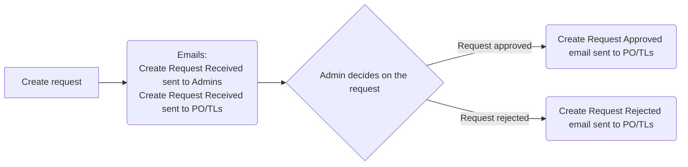
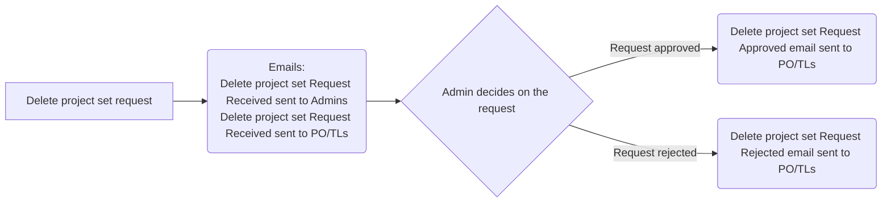
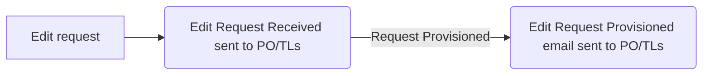

## Email Scenarios

### Private Cloud

#### New Project Set Request Email Scenarios

1. New Project Set Request Submitted by User:
2. Email notification sent to Admins containing:
   1. Product name/description/ministry/provider
   2. Product contacts list
   3. Product budget/billing
3. Email Notification sent to Product PO/TLs containing:
   1. Product name/description/ministry/provider
   2. Product contacts list
   3. Product budget/billing
4. Request Approval/Rejection by Admin
   1. in case request is approved, an email notification sent to Product PO/TLs containing:
      1. Product name/description/ministry/provider
      2. Product contacts list
      3. Product budget/billing
      4. Admin review comments.
   2. in case request is rejected, an email notification sent to Product PO/TLs containing:
      1. Product name
      2. Admin review comments

#### Delete request emails Scenarios

1. A new delete request is submitted by the user.
2. An email notification is sent to admins, containing:
   1. Product name/description/ministry/provider
   2. Product contacts list
   3. Product budget/billing
3. An email notification of the request received is sent to Product PO/TLs, which includes:
   1. Product name/description/ministry/provider
   2. Product contacts list
   3. Product budget/billing
4. The request is approved/rejected by the Admin.
   1. In case request is approved, an Email notification of the approved request is sent to Product PO/TLs, containing:
      1. Product name/description/ministry/provider
      2. Product contacts list
      3. Product budget/billing
      4. Admin review comments.
   2. In case request is rejected, an Email notification of the rejected request is sent to Product PO/TLs, containing:
      1. Product name
      2. Admin review comments

#### Edit List of Contacts or/and Names or/and Descriptions or/and Ministries or/and Budget or/and Billing

1. A new edit request is submitted by a user.
2. An email notification request received is sent to Product PO/TLs, containing:
   1. Product name/description/ministry/provider
   2. Product contacts list
   3. Requested changes
   4. Current values for requested changes
3. An email notification request provisioned is sent to Product PO/TLs, containing:
   1. Product name/description/ministry/provider
   2. Product contacts list
   3. Updated values

