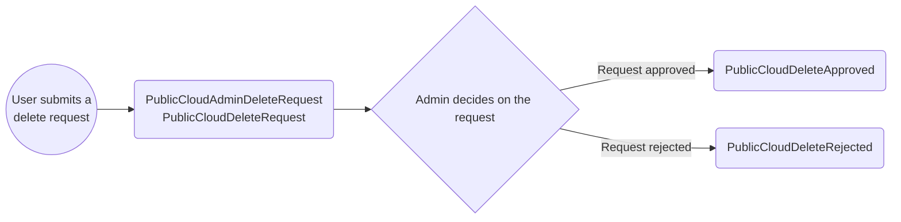

## Email Scenarios

### Public Cloud

#### Scenario 1. Product Create Request

**Description**: A new or existing user submits a request via the registry to have a product on the Public Cloud Landing Zone. This is assuming the user has already had an onboarding meeting, and meets the requirements for submitting a create request. Upon submitting the create request, the following emails may trigger.

1. **Notification sent to admins** containing:
   <ol type="a">
     <li>Product Details (Name, Description, Ministry, Contacts of PO/TL(s)/EA)</li>
     <li>Landing Zone Details (Provider, Budget details, Account Coding)</li>
   </ol>
2. **Notification sent to Product PO/TL(s)** containing:
    <ol type="a">
      <li>Product Details (Name, Description, Ministry, Contacts of PO/TL(s)/EA)</li>
      <li>Landing Zone Details (Provider, Budget details, Account Coding)</li>
   </ol>
3. **Decision: Create request Approval/Rejection by Admin**

- **3a.I. Approval sent to PO/TLs** containing:
   <ol type="a">
      <li>Product Details (Name, Description, Ministry, Contacts of PO/TL(s)/EA)</li>
      <li>Landing Zone Details (Provider, Budget details, Account Coding)</li>
   </ol>
- **3a.II. Notification sent to Expense Authority** containing:
   <ol type="a">
      <li>Product Details (Name, Description, Ministry, Contacts of PO/TL(s)/EA, Licence Plate)</li>
   </ol>
- **3b. Rejection sent to PO/TLs** containing:
   <ol type="a">
      <li>Product Details (Name, Description, Ministry, Contacts of PO/TL(s)/EA)</li>
      <li>Admin review comments</li>
   </ol>

```mermaid
flowchart LR
 flowchart LR
    A((User Submits a <br> Create Request)) --> B(PublicCloudAdminCreateRequest<br>PublicCloudCreateRequest)
    B --> C{Admin decides on the create request}
    C -->|Create Request Approved and Provisioned| D(PublicCloudRequestProvisioned<br>ExpenseAuthorityNotification)
    C -->|Create Request Rejected| E(PublicCloudCreateRejected)
```

#### Scenario 2. Edit Request

**Description**: A PO/TLs of a product submits a request changing some details of the existing product. Since there is no decision process for editing a product, a summary of the previous and updated changes are triggered.

1. **Summary sent to PO/TLs** containing:
   <ol type="a">
     <li>User Comments</li>
     <li>Description Changes (Name, Description, Ministry)</li>
     <li>Contact Changes</li>
     <li>Budget Changes</li>
     <li>Account Coding Changes</li>
   </ol>
2. **If EX changed summary sent to EA** containing:
<ol type="a">
    <li>Product Details (Name, Description, Ministry, Contacts of PO/TL(s)/EA, Licence Plate)</li>
 </ol>

```mermaid
flowchart LR
   flowchart LR
     A((User Submits an <br> Edit Request)) --> |Request Provisioned|B(Edit Request Received sent to PO/TLs)
   B(PublicCloudEditSummary) --> C{EX changed}
    C -->|EX was changed| D(ExpenseAuthorityNotification)
```

#### Scenario 3. Delete request is submitted

**Description**: When a PO/TLs of a product are ready to decomission their product off the Public Cloud Landing Zone the user can submit a delete request and thus the following emails may trigger.

1. **A notification sent to admins** containing:
   <ol type="a">
      <li>Product Details (Name, Description, Ministry, Contacts of PO/TL(s))</li>
      <li>Landing Zone Details (Provider, Budget details, Account Coding)</li>
   </ol>
2. **A summary sent to PO/TLs** containing:
   <ol type="a">
      <li>Product Details (Name, Description, Ministry, Contacts of PO/TL(s))</li>
      <li>Landing Zone Details (Provider, Budget details, Account Coding)</li>
   </ol>
3. **Decision: Product Deletion Approval/Rejecton by admins**

- **3a. Approval confirmation sent to PO/TLs** containing:
    <ol type="a">
      <li>Product Details (Name, Description, Ministry, Contacts of PO/TL(s)/EA)</li>
      <li>Landing Zone Details (Provider, Budget details, Account Coding)</li>
   </ol>
- **3a. Rejection sent to PO/TLs** containing:
    <ol type="a">
      <li>Product Details (Name, Description, Ministry, Contacts of PO/TL(s)/EA)</li>
      <li>Review comments</li>
   </ol>


