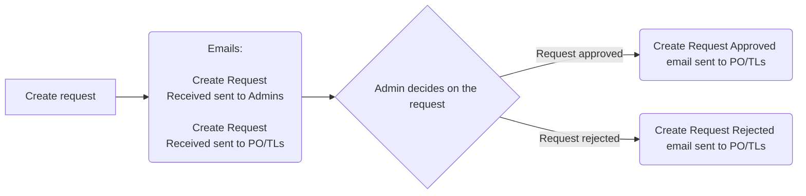
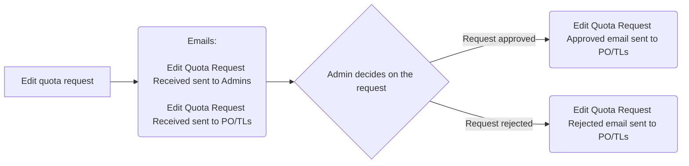
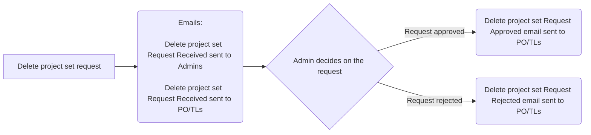
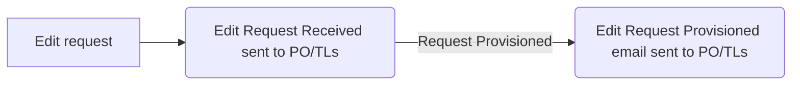

## Email Scenarios

### Private Cloud

#### New project set request emails Scenarios

1. New Project set request is submitted by user
2. Email notification to Admins is sent, it contains:
   1. Product name/description/ministry/cluster
   2. Product contacts list
   3. Product namespace details
3. Email notification request received to Product PO/TLs is sent, it contains:
   1. Product name/description/ministry/cluster
   2. Product contacts list
   3. Product namespace details
   4. Default quota
4. Request is approved/rejected by Admin
   1. in case request approved Email notification request approved to Product PO/TLs is sent, it contains:
      1. Product name/description/ministry/cluster
      2. Product contacts list
      3. Product namespace details
      4. Default quota
      5. Admin review comments4.
   2. in case request rejected Email notification request rejected to Product PO/TLs is sent, it contains:
      1. Product name
      2. Admin review comments

#### Edit quota request emails Scenarios

1. New Edit quota request is submitted by user
2. Email notification to Admins is sent, it contains:
   1. Product name/description/ministry/cluster
   2. Product contacts list
   3. Product namespace details
3. Email notification request received to Product PO/TLs is sent, it contains:
   1. Product name/description/ministry/cluster
   2. Product contacts list
   3. Product namespace details
   4. Requested quota
   5. Current quota
4. Request is approved/rejected by Admin
   1. in case request approved Email notification request approved to Product PO/TLs is sent, it contains:
      1. Product name/description/ministry/cluster
      2. Product contacts list
      3. Product namespace details
      4. Updated quota
      5. Admin review comments.
   2. in case request rejected Email notification request rejected to Product PO/TLs is sent, it contains:
      1. Product name
      2. Admin review comments

#### Delete request emails Scenarios

1. New Delete quota request is submitted by user
2. Email notification to Admins is sent, it contains:
   1. Product name/description/ministry/cluster
   2. Product contacts list
   3. Product namespace details
3. Email notification request received to Product PO/TLs is sent, it contains:
   1. Product name/description/ministry/cluster
   2. Product contacts list
   3. Product namespace details
4. Request is approved/rejected by Admin
   1. in case request approved Email notification request approved to Product PO/TLs is sent, it contains:
      1. Product name/description/ministry/cluster
      2. Product contacts list
      3. Product namespace details
      4. Admin review comments.
   2. in case request rejected Email notification request rejected to Product PO/TLs is sent, it contains:
      1. Product name
      2. Admin review comments

#### Edit List of Contacts or/and Name or/and Description or/and Ministry or/and Common Components request emails Scenarios

1. New Edit request is submitted by user
2. Email notification request received is sent to Product PO/TLs, it contains:
   1. Product name/description/ministry/cluster
   2. Product contacts list
   3. Product namespace details
   4. Requested changes
   5. Current values for requested changes
3. Email notification request provisioned is sent to Product PO/TLs, it contains:
4. Product name/description/ministry/cluster
5. Product contacts list
6. Product namespace details
7. Updated values

