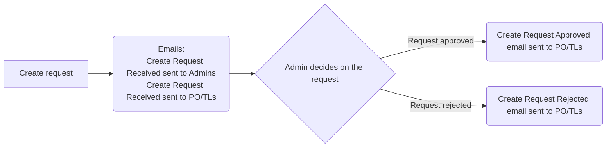
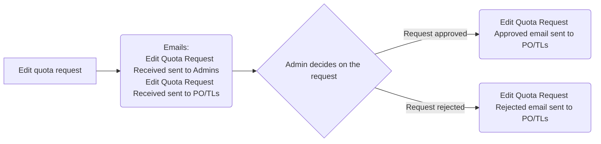
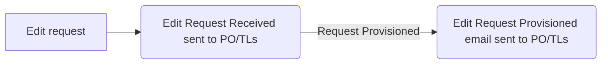

## Email Scenarios

### Private Cloud

#### New project set request emails Scenarios

1.

#### Edit quota request emails Scenarios

#### Edit List of Contacts or/and Name or/and Description or/and Ministry or/and Common Components request emails Scenarios

