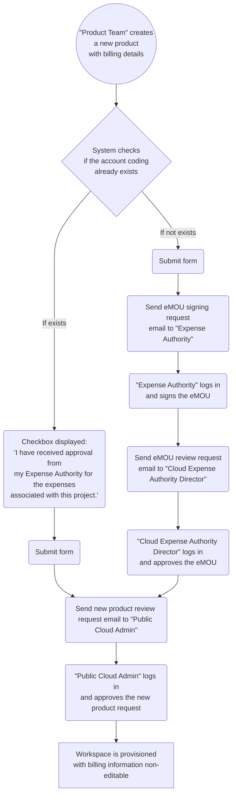

## Public Cloud eMOU Workflow Diagram

```mermaid
flowchart TB
    A((#quot;Product Team#quot; creates<br>a new product<br>with billing details))
    A --> B{System checks<br>if the account coding<br>already exists}
    B -->|If exists| B1A(Checkbox displayed:<br>'I have received approval from<br>my Expense Authority for the expenses<br>associated with this project.')
    B1A --> B1B(Submit form)
    B1B --> C
    B -->|If not exists| B2A(Submit form)
    B2A --> B2B(Send eMOU signing request<br>email to #quot;Expense Authority#quot;)
    B2B --> B2C(#quot;Expense Authority#quot; logs in<br>and signs the eMOU)
    B2C --> B2D(Send eMOU review request<br>email to #quot;Cloud Expense Authority Director#quot;)
    B2D --> B2E(#quot;Cloud Expense Authority Director#quot; logs in<br>and approves the eMOU)
    B2E --> C(Send new product review request email to #quot;Public Cloud Admin#quot;)
    C --> D(#quot;Public Cloud Admin#quot; logs in<br>and approves the new product request)
    D --> E[Workspace is provisioned<br>with billing information non-editable]
```
